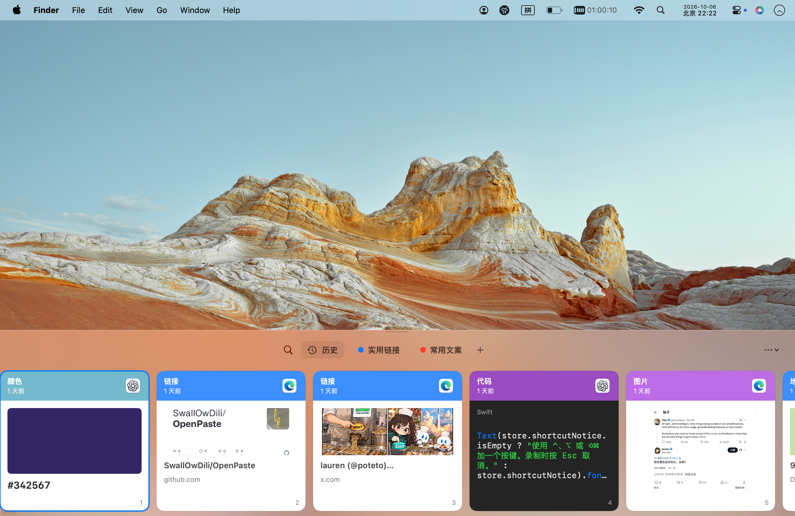
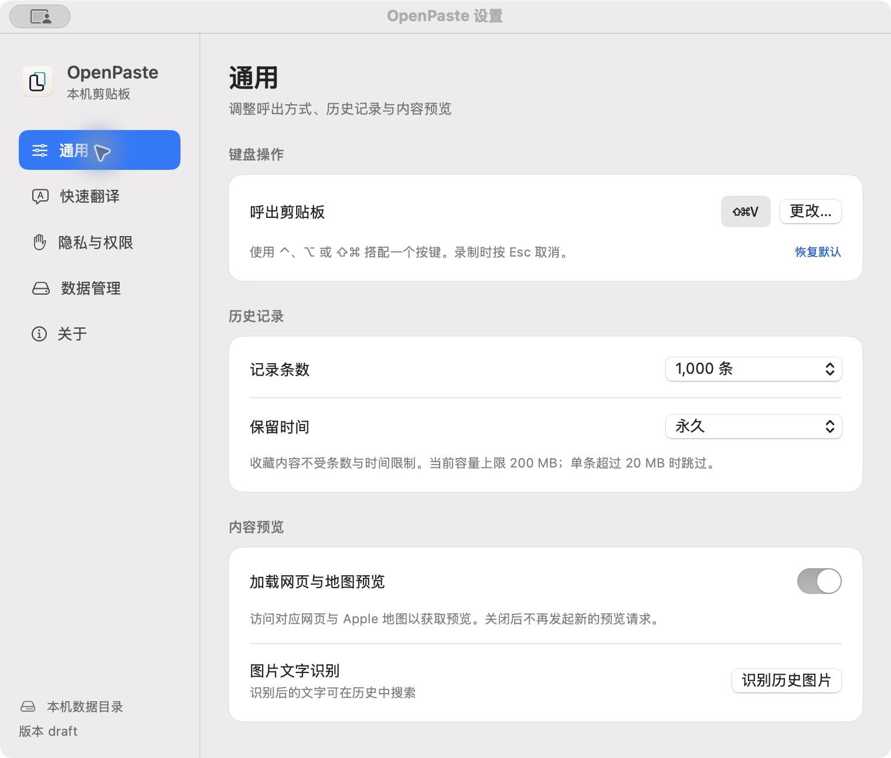

<p align="center">
  
</p>

<h1 align="center">OpenPaste</h1>
<p align="center">为 macOS 打造的剪贴板历史、收藏与快速翻译工具。</p>
<p align="center">macOS 原生应用 · 本机存储 · 个人及公司使用免费</p>

<p align="center">
  <a href="https://github.com/SwallOwDili/OpenPaste/releases">下载安装包</a> ·
  <a href="#使用">使用指南</a> ·
  <a href="https://github.com/SwallOwDili/OpenPaste/issues">反馈问题</a>
</p>

OpenPaste 将复制过的文字、链接、图片和文件引用放进贴近屏幕底部的横向卡片列表。通过键盘搜索、预览和取用，也可整理收藏分组、导入 Paste 历史，或连接自己的 OpenAI 兼容翻译服务。

## 界面预览

**贴近桌面的剪贴板卡片**：一屏浏览颜色、网页链接预览、代码语法高亮和图片，通过历史与收藏分组快速取用。



## 功能

| 功能 | 说明 |
| --- | --- |
| 剪贴板历史 | 保存文字、链接、图片、文件引用及可读取的原始格式，自动去重 |
| 搜索与筛选 | 搜索文字、链接、来源和已识别的图片文字，按类型、来源、日期和收藏筛选 |
| 收藏分组 | 自定义分组名称与颜色，收藏不受历史条数和保留时间清理影响 |
| 预览与编辑 | 空格查看完整内容，新建或编辑文字、重命名条目、旋转图片、提取图片文字 |
| 颜色 | 识别颜色值、显示色块，支持编辑颜色 |
| 代码 | 常见语言启发式识别、等宽字体和语法高亮；支持富文本取用与纯文本取用 |
| 链接与地图 | 网页标题和缩略图、Apple 地图位置预览；成功预览在本机缓存 7 天，缓存最多 100 MB；联网加载可关闭 |
| 批量操作 | 多选、批量粘贴、删除与撤销；图片和文件可拖出，接受能力取决于目标应用 |
| 粘贴队列 | 将所选条目加入队列，按顺序逐条取用，显示剩余数量 |
| 快速翻译 | 呼出时翻译选中文字，译文置顶，取用后替换原选区 |
| Paste 导入 | 本机导入历史、来源、收藏和原始格式，去重、备份并显示进度 |
| 数据目录 | 自定义保存目录、迁移历史与附件，支持选择 iCloud Drive 文件夹 |
| 关于与更新 | 应用介绍、许可查看、GitHub 正式 Release 检测与下载入口 |
| 记录控制 | 暂停记录、排除应用、历史条数和保留时间设置；清空历史时保留收藏 |

## 安装

> **安装前请注意**：v0.0.4 起（预发布版自 v0.0.4-rc1 起）安装包使用固定的自签名证书签名，尚未经过 Apple Developer ID 签名和公证。首次打开可能被 macOS 拦截；请确认安装包来自本项目 Release，按系统提示允许打开。之后同一证书签名的版本互相更新，辅助功能权限会保留。从 v0.0.3 及更早的临时签名版本升级时，辅助功能权限需要重新授予一次。

如果系统阻止打开，请先尝试启动一次，再进入 **系统设置 → 隐私与安全性**，在对应提示中选择“仍要打开”（具体文字因 macOS 版本而异）。本项目不会要求你关闭系统安全保护。

更新后如果直接粘贴或快速翻译无法读取选区，请进入 **系统设置 → 隐私与安全性 → 辅助功能**，检查 OpenPaste 的权限。若开关已打开但仍未生效，退出 OpenPaste，移除旧条目，重新添加 `/Applications/OpenPaste.app` 并授权，然后重新启动。

需要 **macOS 14 或更新版本**。

1. 前往 [Releases](https://github.com/SwallOwDili/OpenPaste/releases)，下载带有 `macos-universal` 的 ZIP 安装包。
2. 解压后，将 `OpenPaste.app` 拖入「应用程序」。
3. 打开 OpenPaste，启用剪贴板记录；按需授予辅助功能权限。

通用安装包面向 Apple Silicon 和 Intel Mac；Intel 实机兼容性仍待验证。

## 检查更新

菜单栏菜单和「设置 → 关于 → 软件更新」提供 **检查更新**。默认查询最新正式版本；开启 **包含预发布版本** 后也会发现 rc 版本。新版本安装包尚未上传时会提示稍后检查。

**自动检查更新默认关闭**。开启后，应用启动及运行期间最多每 24 小时查询一次；网络失败不会弹窗。发现新版会在菜单和关于页面显示提示，点击后查看更新说明，选择“下载并更新”“稍后”或“跳过此版本”。跳过仅对该版本生效，手动检查可重新查看。

选择“下载并更新”后，应用从本项目的 GitHub Release 下载安装包，校验 SHA-256，并要求新 App 与当前运行的 App 使用同一个 bundle id 和同一签名证书；通过后询问“重启并安装”，确认才退出并替换，随后自动重新打开，并提示“已更新到 x.y.z”；如果替换失败，会保留当前版本并提示“更新未完成”。历史数据保留，辅助功能授权因签名一致而保留。校验或替换失败时当前版本保持不变。

应用内更新只在当前 App 使用固定证书签名、位于可写的应用目录且不在“App Translocation”临时路径中时可用。早期使用临时签名的版本（v0.0.3 及更早）无法验证新版来源，需要手动下载一次；之后的版本可在应用内更新。不满足条件时，弹窗仍提供“前往下载”。

版本检查只向 GitHub 发送公开版本查询，下载只请求本项目 Release 资源，不上传剪贴板内容、翻译密钥或本机数据。没有使用系统通知，也不会在未经确认时下载或安装。

## 使用

首次运行时启用记录，按 **⌘⇧V** 呼出历史。快捷键可以在设置中录制，支持 **Command + 按键**，也支持 Control、Option 及组合修饰键；已有用户保留自己的配置。

在「设置 → 隐私与权限」授予辅助功能权限后，可直接粘贴回原输入框。未授权时，取用条目会复制到剪贴板，再手动按 ⌘V。

| 快捷键 | 操作 |
| --- | --- |
| ← / → | 选择条目 |
| Return | 取用并粘贴；未授权时复制 |
| ⇧Return | 纯文本取用（⇧ 可在设置中更改，快速粘贴同样适用） |
| ⌘1–9 | 快速取用对应条目（修饰键可在设置中更改） |
| ⌘F | 搜索 |
| ⌘N | 新建文字 |
| ⌘Return | 取用粘贴队列下一条 |
| ⌘← / ⌘→ | 切换上一个 / 下一个收藏分组（含“历史”，循环；可在设置中更改） |
| Space | 完整预览；预览中 ← / → 切换上一条 / 下一条，Space 或 Esc 关闭 |
| ⌘E / ⌘R / ⌘O | 编辑 / 重命名（卡片标题就地修改，不改内容）/ 打开 |
| 鼠标滚轮 | 在卡片列表中直接横向滚动 |
| ⌘⌫ | 删除选中条目 |
| 按住 ⌘⇧ | 临时反转列表，释放后恢复 |
| ⌘⇧⌫ | 从反转列表中删除，可连续删除较早条目 |
| ⌘Z | 撤销最近的条目操作 |
| ⌘, | 设置 |
| Esc | 关闭当前面板或设置窗口 |

退出程序可在设置左下角点击 **退出 OpenPaste**，或从菜单栏菜单选择退出；关闭设置窗口不会退出程序。

多选支持 ⌘ 点击切换条目、Shift 点击或方向键选择范围。选中多条内容后，可从面板右上角菜单选择 **所选加入粘贴队列**，再按 ⌘Return 逐条取用；点击“结束”可清空队列。代码样式是否保留，取决于目标应用是否接受 RTF / HTML；普通文本输入框仍只会收到原文。

## 快速翻译

在「设置 → 快速翻译」开启功能，填写 **Base URL、API Key、模型和目标语言**，然后保存。

下面的地址和模型是演示占位值，使用时需填写自己的服务配置。

```text
Base URL: https://your-service.example/v1
模型:     服务支持的模型名称
目标语言: 英文
```

选中文字后呼出剪贴板，译文会出现在第一张卡片。按回车取用，在原输入框替换原选区；生成失败或未取用时不会覆盖原文。

- 支持 HTTP 和 HTTPS。HTTP 会明文传输 API Key 与选中文字。
- API Key 与其他设置一同保存在本机应用配置中（`~/Library/Preferences/io.github.SwallOwDili.OpenPaste.plist`），不随剪贴板历史同步；选中文字发送到你配置的服务。
- 不接受 URL 内账号、查询参数或片段；不跟随重定向。
- 选中文字上限 60 KB。辅助功能选区读取不被目标应用支持时，会尝试复制选区并恢复剪贴板。

<details>
<summary>查看通用设置：快捷键、历史保留与内容预览</summary>

<p align="center">
  
</p>

</details>

## 数据存储与 iCloud Drive

历史默认保存在 `~/Library/Application Support/OpenPaste/`。

在「设置 → 数据管理 → 更改目录」选择专用文件夹。历史、收藏和附件一起迁移，目标已有历史会合并；迁移显示进度，校验成功后切换，源目录保留。

选择 **iCloud Drive** 中的文件夹后，由 macOS 同步文件。另一台 Mac 选择同一 Apple 账户下的同一个文件夹，即可读取和合并历史。

同步速度取决于 iCloud 和网络，可能存在延迟。为保护离线设备仍可能引用的内容，共享目录中的附件不会自动回收；本地历史与本机离线缓存会回收无引用附件，撤销记录和备份仍需使用的附件会保留。请勿单独移动或删除数据目录内的文件。

本机离线缓存位于 `~/Library/Application Support/OpenPaste-sync-cache`。API Key、快捷键、权限和其他偏好不随历史同步。文件条目只保存原路径引用，另一台 Mac 不一定能访问该文件。

## 隐私与限制

OpenPaste 无需账号，剪贴板历史默认保存在本机。以下功能会使用网络：

| 功能 | 联网用途 |
| --- | --- |
| 网页与地图预览 | 访问对应网页及 Apple 地图，可在通用设置中关闭新预览请求；内网地址和疑似验证链接需点击加载 |
| 快速翻译 | 将选中文字发送给你配置的翻译服务 |
| 检查更新 | 向 GitHub 查询公开 Release 信息 |
| iCloud Drive | 选择 iCloud 目录后，由 macOS 同步历史与附件 |
| 使用统计 | 官方 Release 默认开启 Google Firebase Analytics，可在隐私设置中关闭 |

OpenPaste 主动记录的统计仅包含三项，不附带内容参数：

| 统计 | 含义 |
| --- | --- |
| 首次启动 | 用于估算安装量；安装但从未打开的 App 不会计入 |
| 自动粘贴 | 成功发送自动粘贴快捷键的次数；仅复制不计入，不代表目标应用已接收内容 |
| 翻译成功 | 成功完成翻译的次数 |

Firebase SDK 还会处理应用实例标识、设备与应用版本等基础信息，并可能产生自动事件；统计不是严格的下载安装计数。OpenPaste 不向统计服务发送剪贴板内容、所选文字、网址、文件路径或翻译 API Key。

可在 **设置 → 隐私与权限** 关闭统计，关闭后停止收集并清除本机统计标识。**关于** 页面提供当前统计状态及数据说明。自行构建且未提供 Firebase 配置时不启用统计。

预览地址检查属于保守规则，不能识别所有一次性链接，也不保证阻止 DNS 解析或重定向后的内网访问。不希望复制链接时联网，可关闭网页与地图预览。

历史未单独加密。默认排除常见密码管理器及带敏感标记的剪贴板内容，但不能可靠识别普通文字中的密码。可按需要排除应用或暂停记录。

暂停状态在退出和重启后保留。恢复后只记录新的复制，不补录暂停期间留在剪贴板中的内容。“直到手动恢复”需要主动继续记录；定时暂停按原到期时间恢复，重启不会延长暂停时间。

- 极短时间内连续复制的中间内容可能漏记。
- 条数可设为不限制，但总容量仍有上限；单条超过 20 MB 时跳过。
- 来源根据捕获时的前台应用推断，不保证完全准确。
- 代码语言识别为启发式；地图链接、网页预览和拖放不能覆盖所有格式与应用。
- 实体多 Mac 的 iCloud 同步、长期运行及多显示器场景尚未完整验证。

## 反馈与贡献

遇到问题或有功能建议，欢迎提交 [Issue](https://github.com/SwallOwDili/OpenPaste/issues)。反馈时请说明 macOS 版本和操作步骤，截图注意遮挡私人内容。

欢迎通过 PR 贡献修复和功能。首次贡献前请阅读 [CLA 英文原文](CLA.md)或[中文译文](CLA.zh-CN.md)，并用自己的 GitHub 账号在 PR 评论中回复：

> I have read and agree to the OpenPaste CLA v1.0.

同一版本只需签署一次；多位贡献者需逐人签署，维护者也适用。CLA 保留贡献者著作权，并允许项目商业再授权。报告问题无需签署。

贡献流程见 [贡献指南](CONTRIBUTING.md)，源码构建、自动检查与发布见 [开发文档](docs/DEVELOPMENT.md)。

## 许可证

采用 [GNU GPL v3（仅第 3 版）](LICENSE)，并附有依据第 7(b) 条制定的[署名保留条款](NOTICE)。

个人及公司内部使用免费，可自行修改；内部使用无需对外公开修改源码。

对外发行（包括收费售卖）须提供对应源码，保留署名、版权声明和许可证，注明修改，并保留接收者的 GPL 权利。有交互界面的发行版本须在「关于」或法律声明中清晰展示 [原项目地址](https://github.com/SwallOwDili/OpenPaste)、版权声明和许可证入口。

闭源发行、免除 GPL 义务或移除规定的项目声明，需联系作者获取单独的付费书面授权。符合 GPL 的收费发行无需另付授权费；单独授权不免除第三方声明义务。详细规则见 [许可说明](docs/LICENSING.md)。

App 内置中英文许可与署名文件，可在「关于」中查看；中文为参考译文，法律条款以英文原文为准。
